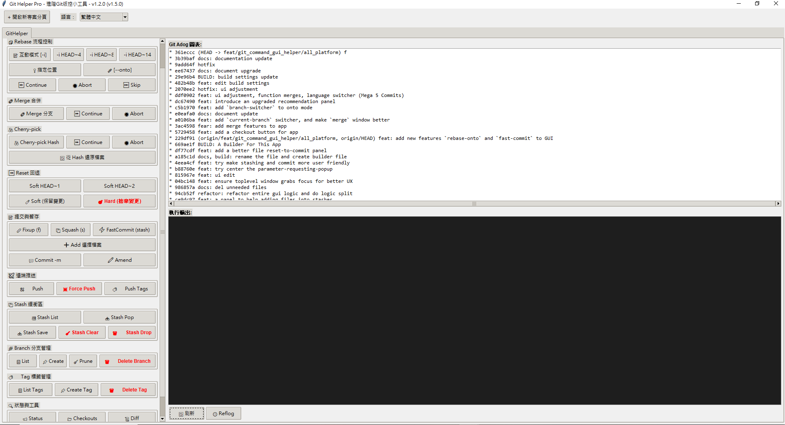

# Git Helper Pro

> 為進階開發者與 Project Lead 設計的 Git 圖形化管理工具  
> 讓複雜的 Git 操作變得簡單、直觀、不出錯




---

## 為什麼需要這個工具？

SourceTree / GitKraken 適合基本操作（commit、push、pull）。  
**Git Helper Pro** 專注於進階操作，並提供參數驗證與安全機制，避免下錯指令造成災難。

---

## 🚀 快速開始

**需求**：Python 3.8+，Git（任意版本）

```bash
python GUI__GitHelperPro.py
```

1. 點擊「**+ 開啟新專案分頁**」
2. 選擇含有 `.git` 的資料夾
3. 開始使用

---

## ✨ 功能總覽

| 群組 | 功能 |
|------|------|
| ⚡ 快速執行 | 任意 Git 指令輸入框，Enter 即執行 |
| 🛠️ 快速互動 Rebase | HEAD~2 / HEAD~4 / HEAD~10 一鍵執行 |
| 🔄 Rebase 流程控制 | 互動模式、指定位置、--onto 對話框、Continue / Abort / Skip |
| 🔀 Merge 合併 | 四模式合併對話框、Continue / Abort |
| 🍒 Cherry-pick | 批量 hash、-n 模式、Continue / Abort |
| ⏪ Reset 回退 | Soft HEAD~1/2、Soft/Hard 自訂範圍 |
| 📝 提交與暫存 | Fixup / Squash / FastCommit、Add 選檔器、Commit -m、Amend |
| ✈️ 遠端推送 | Push、Force Push（含 --force-with-lease）、Push Tags |
| 📦 Stash 緩衝區 | Save / Pop / List / Drop / Clear |
| 🌿 Branch 分支管理 | List、Checkout 搜尋器、Create、Del Local / Remote、Prune |
| 🏷️ Tag 標籤管理 | List / Create / Del Local / Del Remote |
| 🔍 狀態與工具 | Status、Diff、Clean -fd、Checkout File |

---

## 📖 常見使用情境

**整理最近幾個 commit**
```
1. 點擊「HEAD~10」或「互動模式」
2. 在 Git 編輯器中調整：pick → squash / reword / edit
3. 儲存關閉
4. 若有衝突 → 解決後點「▶️ Continue」
```

**將 feature 合回 main（保留歷史）**
```
1. Checkout 到 main
2. 點擊「🔀 Merge 分支」→ 選擇來源分支 → 模式選「--no-ff」→ 執行
```

**Checkout 到某個舊 commit**
```
1. 點擊「📂 Checkouts」
2. 在搜尋框輸入部分 hash 或關鍵字 → 從清單點選 → 執行
```

**安全 Force Push**
```
1. 點擊「⚡ Force Push」
2. 勾選「安全強推 (--force-with-lease)」→ 執行
```

**清理過期分支**
```
1. 點擊「🧹 Prune」→ 先勾選「僅預覽」確認範圍 → 取消預覽後執行
```

**進階Git管理功能**
```
1. 快速的 stash, commit -m "fixup", commit -m "squash"
2. rebase 中的 -i 或者 --onto
3. merge 的多種操作
4. 從某個hash還原部分檔案
```

---

## 🔒 安全機制

1. **必填驗證** — 未填寫時紅框標記，阻止執行
2. **危險操作標示** — 紅色按鈕（Hard Reset、Force Push、Clean 等），需額外確認
3. **即時回饋** — Terminal 區域顯示完整指令與輸出
4. **Reflog 保護** — 隨時查看操作歷史，方便 `reset` 復原
5. **UTF-8 編碼** — 正確處理中文路徑與檔名，不閃退

---

## 適用對象

✅ 需要頻繁 rebase 整理提交歷史  
✅ 管理多個功能分支與實驗性分支  
✅ 需要安全的 merge 策略選擇  
✅ 經常需要 cherry-pick 特定 commit  
✅ 快速在分支 / tag / commit 間切換  
✅ 團隊協作中需要清理過期分支  

❌ Git 初學者（建議先熟悉基本指令）  
❌ 只需要簡單 commit/push/pull  

---

## 📚 文件目錄

| 文件 | 說明 |
|------|------|
| [功能詳細說明](docs/features.md) | 每個功能的對話框介面、參數說明與操作細節 |
| [指令對照表](docs/commands-reference.md) | 所有 UI 按鈕對應的 Git 指令 |
| [多語言支援](docs/multilang.md) | 語言切換、自訂語言、exe 覆蓋機制 |
| [開發者指南](docs/development.md) | 檔案結構、技術細節、已知問題記錄 |

---

## 📄 License

MIT License — Made with ❤️ for Git Power Users & Project Leads
